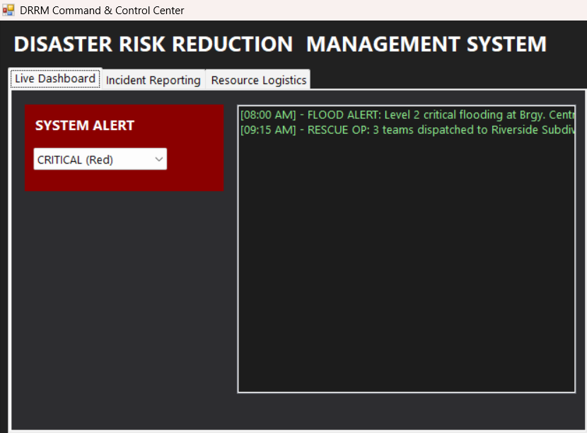
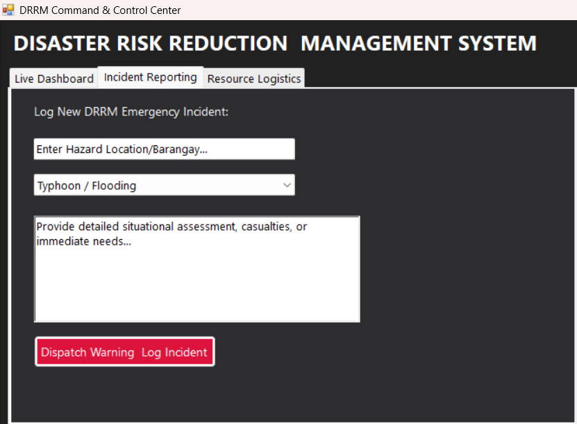

# DRRM Command & Control System

A Windows desktop application (C++/CLI, Windows Forms) that simulates a **Disaster Risk Reduction and Management (DRRM)** command center. It provides a live dashboard for active alerts, a form for logging emergency incidents, and a resource/logistics tracker for deployable assets such as rescue teams and vehicles.

## Overview

The application is built with **C++/CLI** targeting the **.NET Windows Forms** UI framework. It is organized into a single main window (`MainForm`) with three tabs:

| Tab | Purpose |
|---|---|
| **Live Dashboard** | Displays the current alert level (Critical / Warning / Monitoring) and a running log of active incidents. |
| **Incident Report** | A form for logging a new emergency incident (location, disaster type, and details), which is pushed to the dashboard log. |
| **Resource Logistics** | A grid of deployable assets (rescue boats, medical trucks, search & rescue teams) with the ability to flag an asset as deployed. |

This project currently uses in-memory mock data seeded on startup (see `MainForm_Load`) and is intended as a UI prototype / foundation for a full DRRM information system.

<p align="center">
  
</p>

<p align="center">
  
</p>


## Features

- 🚨 **Alert Status Panel** — color-coded (red/orange/green) based on the selected alert level.
- 📋 **Incident Logging** — capture location, disaster type, and free-text details; new incidents are prepended to the active incident list.
- 🚑 **Resource Tracking** — a `DataGridView` of assets with one-click "Deploy" status updates.
- 🎨 **Dark-themed UI** styled for a command-center / operations-room look and feel.

## Project Structure

```
.
├── MainForm.h      # Form definition, designer-generated UI layout, and event handlers
├── MainForm.cpp     # Application entry point (main)
└── ...              # Additional project/solution files (.vcxproj, .sln) as applicable
```

## Requirements

- Windows OS
- Visual Studio (2019 or later recommended) with the **.NET desktop development** and **C++/CLI support** workloads installed
- .NET Framework (compatible with Windows Forms via C++/CLI)

## Building & Running

1. Clone or download this repository.
2. Open the solution (`.sln`) file in Visual Studio.
3. Ensure the **C++/CLI** individual component is installed (Visual Studio Installer → Individual Components → "C++/CLI support").
4. Build the solution (`Ctrl+Shift+B`).
5. Run the project (`F5`) — this launches the `MainForm` window via the `main()` entry point in `MainForm.cpp`.

> **Note:** If your project's root namespace differs from `DRRMSystem`, update the namespace reference in `MainForm.cpp` accordingly.

## Roadmap Ideas

- Persist incidents and resources to a database instead of in-memory mock data
- Real alert broadcasting integration (SMS/email/push)
- User authentication and role-based access (dispatcher, field responder, admin)
- Mapping/GIS integration for incident geolocation
- Historical reporting and analytics

## Contributing

Contributions are welcome! Please see [CONTRIBUTING.md](CONTRIBUTING.md) for guidelines on how to get involved, and review our [CODE_OF_CONDUCT.md](CODE_OF_CONDUCT.md) before participating.

## License

No license has been specified yet for this project. Consider adding a `LICENSE` file (e.g., MIT, Apache 2.0) to clarify how others may use, modify, and distribute this code.